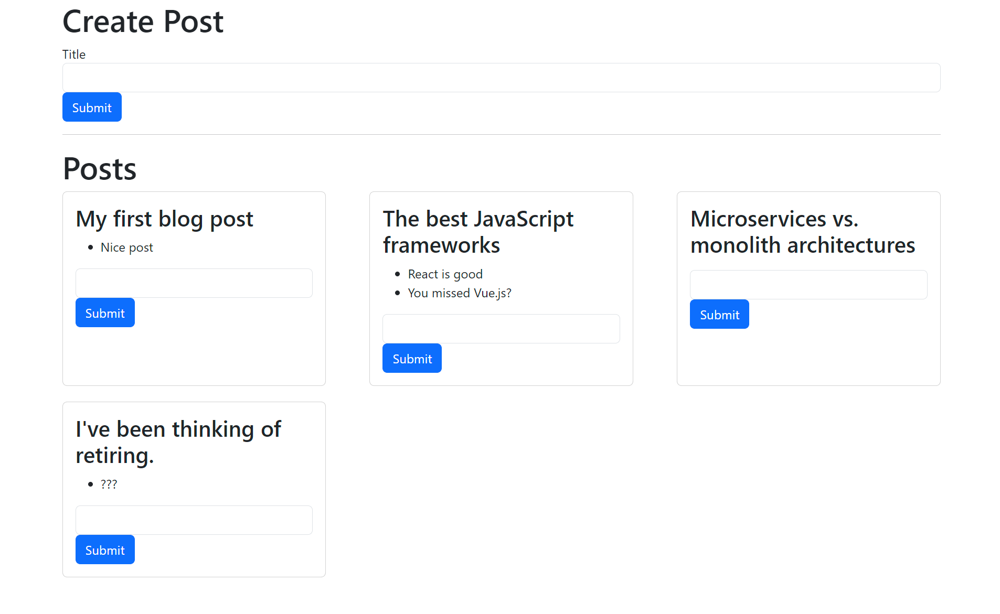

# Microservices Blog

This was built for the purpose of applying a microservices architecture to a small product within a devcontainer.

The resulting application is a hideous frontend powered by a microservices backend.



## Architecture

## Deployment
### Summary of deploy steps

1. Ensure `.devcontainer/postCreateCommands.sh` has successfully run, this will start `minikube` and install `skaffold`.
2. Get ip of minikube with `minikube ip`.
3. Find port of the NodePort to forward `kubectl get service --all-namespaces`.
4. Forward the ingress-nginx-controller NodePorts `<minikube-ip>:<port>` to `localhost:80` and `localhost:443`.
5. Update hosts `C:\Windows\System32\drivers\etc\hosts` file to redirect `posts.com` to `localhost`.
6. Run `skaffold dev`.
7. Visit `posts.com` in a browser.

### Deploy with Skaffold
Skaffold handles all of the deployment. Once minikube is running, ports are forwarded and hosts are updated, run the following:
```
skaffold dev
```

## Resources
These resources are useful when deploying without using skaffold.

### minikube
minikube is local Kubernetes, focusing on making it easy to learn and develop for Kubernetes.
```
minikube start
minikube status
minikube stop
minikube ip
minikube addons enable ingress
```

If getting certificate issues
```
minikube delete 
```

### kubectl
Process all config files and update their resources by
```
kubectl apply -f infra/k8s/
```

Delete all pods
```
kubectl delete -f infra/k8s/
```

Other useful `kubectl` commands
```
kubectl get pods
kubectl exec -it <pod name><command>
kubectl logs <pod name>
kubectl delete pod <pod name>
kubectl apply -f <pod name>
kubectl describe pod <pod name>
kubectl rollout restart deployment <deployment name>
```

### Building images

Before building images run `eval $(minikube docker-env)` so that the Docker daemon running inside of the single node cluster is used instead of the host. E.g.
```
cd posts
eval $(minikube docker-env)
docker build -t posts:0.0.1 .
```
Make sure to add this when pulling locally:
```
imagePullPolicy: Never
```

### Deployment steps without skaffold
```
 minikube start
 minikube addons enable ingress
 # Make sure ports are fowarded (see below)
 cd infra/k8s
 kubectl apply -f ingress-srv.yaml
```

### Ingress and port forwarding
[Dev container Ingress port forwarding](https://github.com/microsoft/vscode-dev-containers/tree/main/containers/kubernetes-helm-minikube#ingress-and-port-forwarding)
1. Get ip of minikube `minikube ip`
2. Find port of the NodePort to forward `kubectl get service --all-namespaces`
3. Forward the ingress-nginx-controller NodePorts `<minikube-ip>:<port>` to `localhost:80` and `localhost:443`
4. Update hosts `C:\Windows\System32\drivers\etc\hosts` file to redirect `posts.com` to `localhost` e.g.
```
127.0.0.1 posts.com
```
